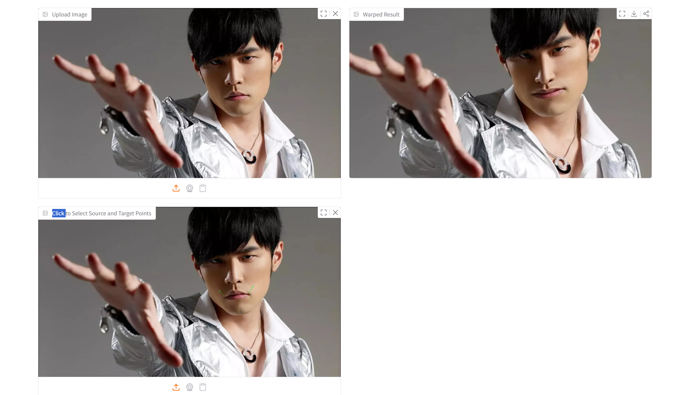
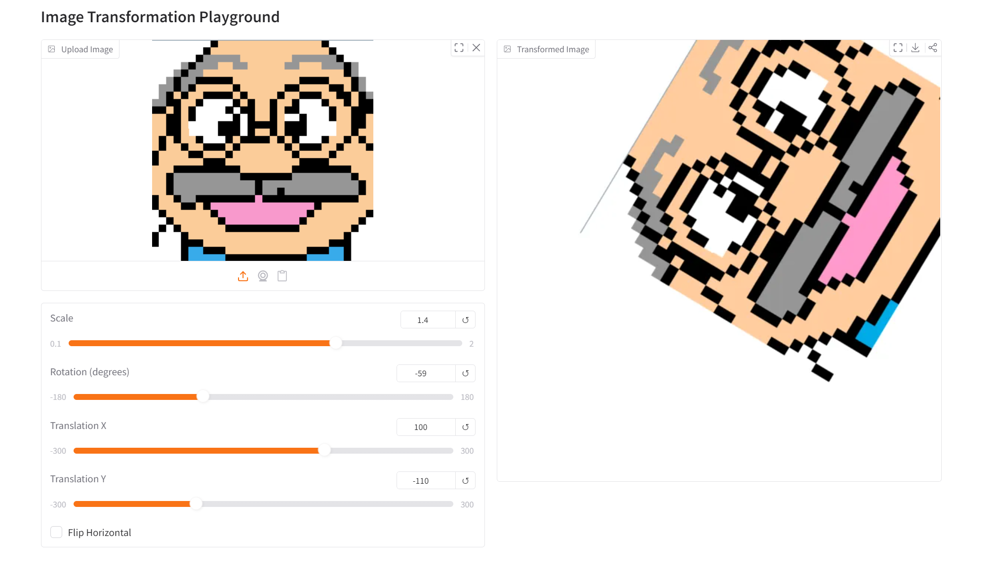
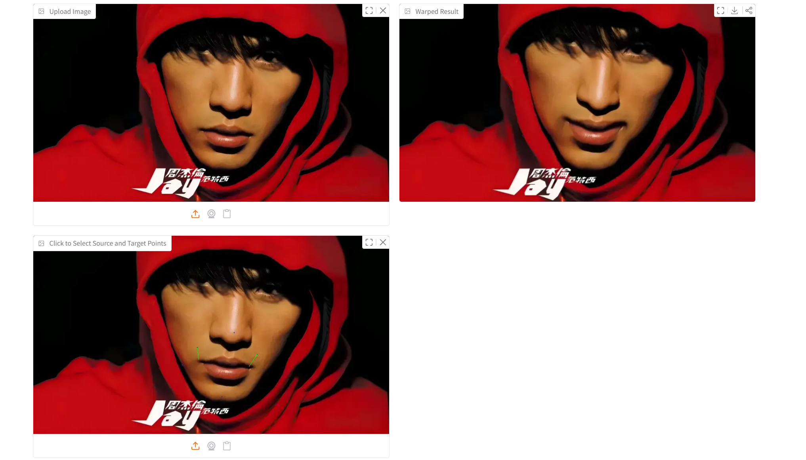

# Assignment 1 - Image Warping

**冯洋SC25005002**

## Implementation of Image Geometric Transformation

This repository is 冯洋's implementation of Assignment_01 of DIP. 




## Requirements

To install requirements:

```setup
python -m pip install -r requirements.txt
```


## Running

To run basic transformation, run:

```basic
python DIP_Assignment1-1.py
```

To run point guided transformation, run:

```point
python DIP_Assignment1-2.py
```

## Results (need add more result images)
### Basic Transformation



### Point Guided Deformation:


