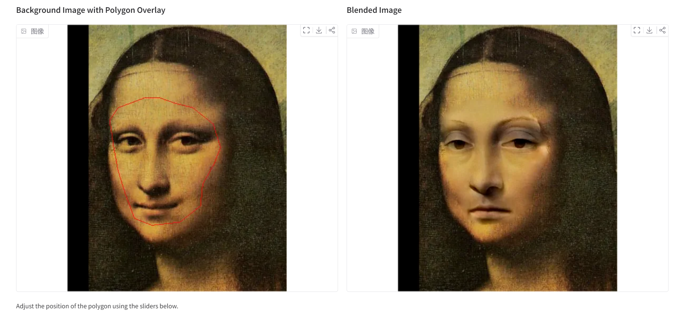
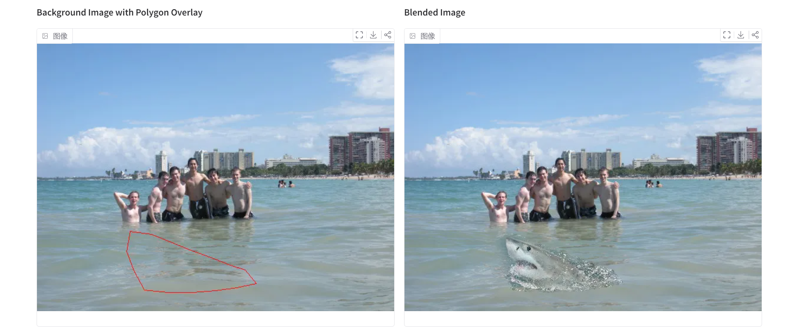
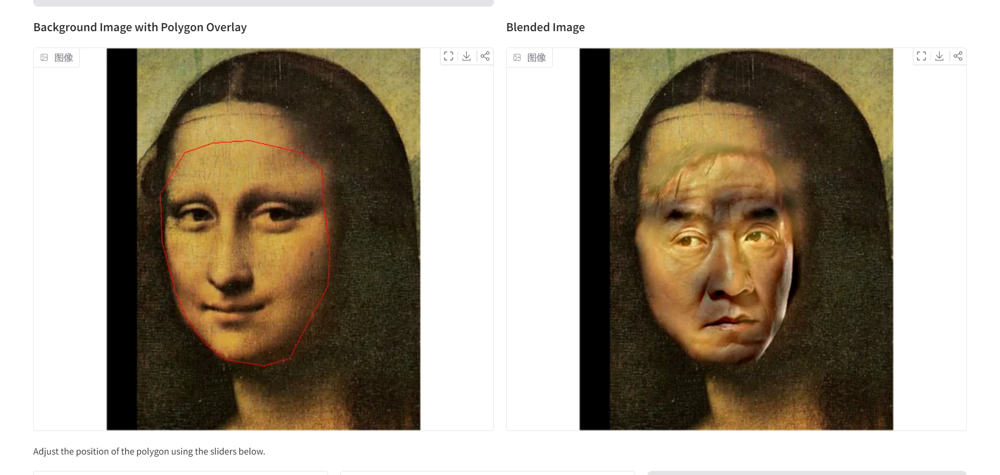
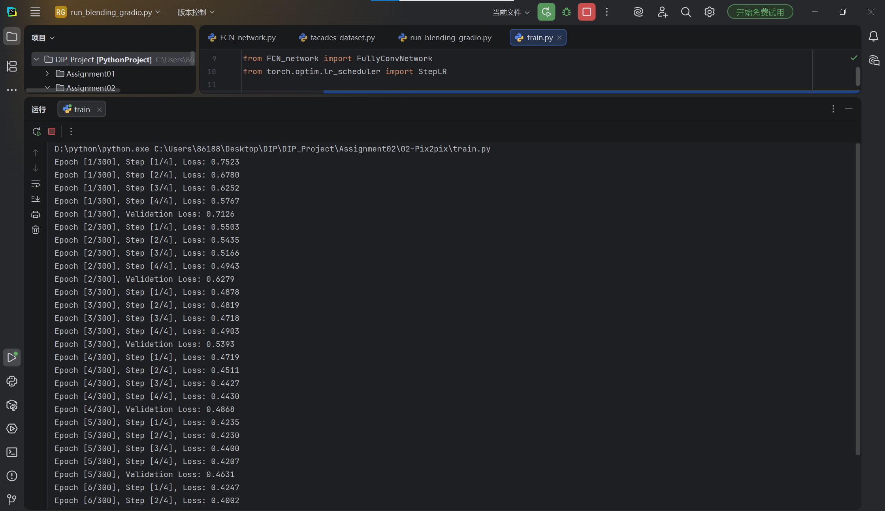
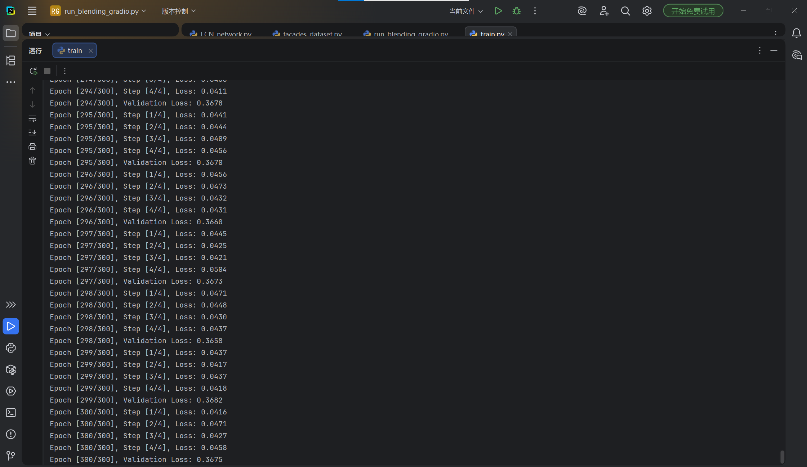
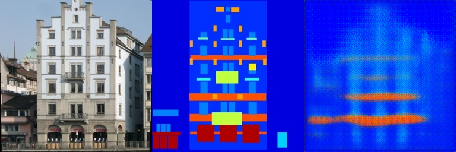
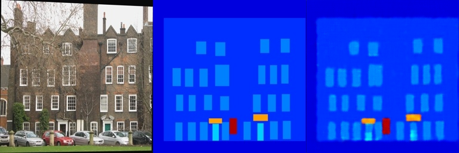
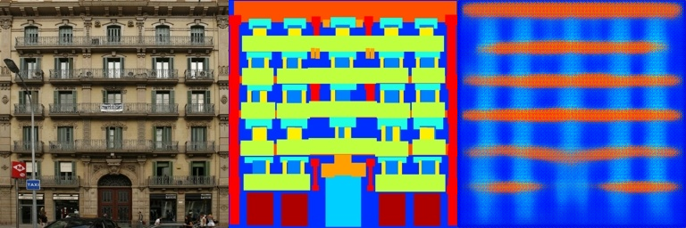
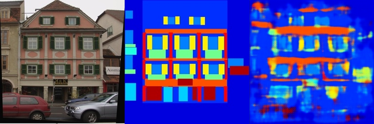

# Assignment02 - DIP with PyTorch 
**冯洋SC25005002**
## 1. Data_poisson

>### [Data_possion01]

## Training

This project does not require model training


## Evaluation

To evaluate my model on ImageNet, run:

```eval
python run_blending_gradio.py
```

## Results


### [Data_possion02 ]



### [Data_possion03 ]


## 2. Pix2pix

## Requirements

To install requirements:

```setup
pip install torch numpy opencv-python gradio
```

## Training

To train the model(s) in the paper, run this command:

```
bash download_facades_dataset.sh --python train.py
```

## Results

Our model achieves the following performance on :
### [first_loss]


### [end_loss]


We can see that the train loss decrease from 0.7523 to 0.0458 and the val loss decrease from 0.7126 to 0.3675

Here is the result of train 13 and train 279 :

### [train result_13]


### [train result_279]


Here is the result of val 13 and val 279 :

### [val result_13]


### [val result_279]



