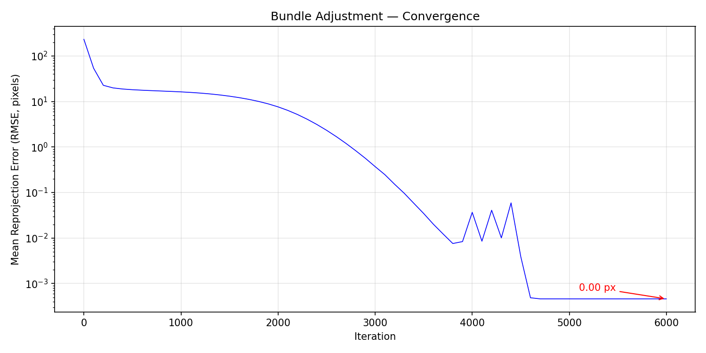
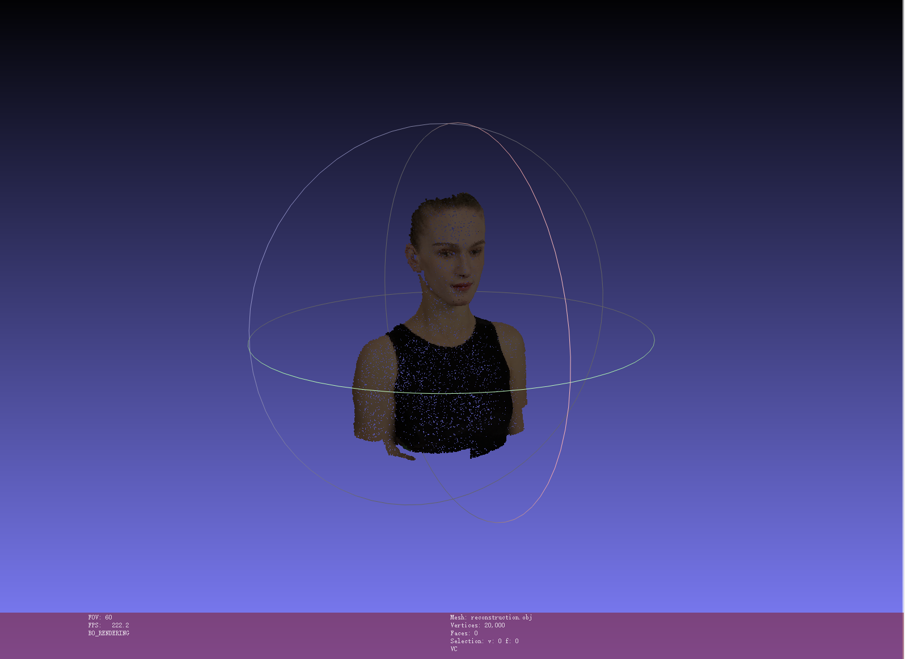
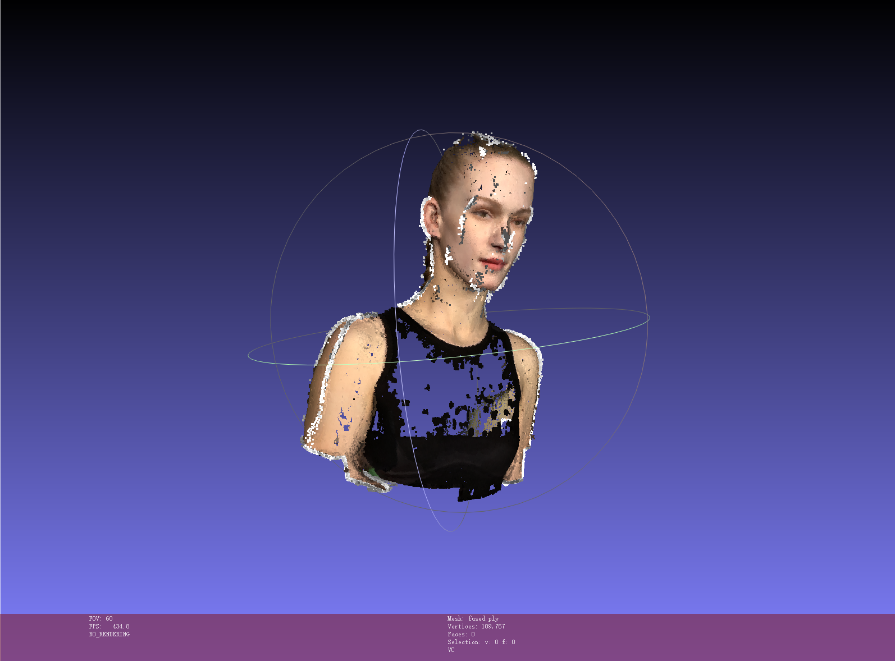

# Assignment 3 — Bundle Adjustment & 3D Reconstruction

**冯洋SC25005002**

---

## 目录

- [Task 1: Bundle Adjustment with PyTorch](#task-1-bundle-adjustment-with-pytorch)
  - [1.1 方法概述](#11-方法概述)
  - [1.2 实现细节](#12-实现细节)
  - [1.3 实验设置](#13-实验设置)
  - [1.4 结果与分析](#14-结果与分析)
- [Task 2: COLMAP 三维重建](#task-2-colmap-三维重建)
  - [2.1 重建流水线](#21-重建流水线)
  - [2.2 结果与分析](#22-结果与分析)
- [总结与讨论](#总结与讨论)

---

## Task 1: Bundle Adjustment with PyTorch

### 1.1 方法概述

Bundle Adjustment（光束平差）是三维重建中的核心优化问题：给定多视角 2D 观测，联合优化三维点坐标、相机外参和内参，使重投影误差最小。

**问题形式化**：

给定 50 个相机视角下 20,000 个三维点的 2D 观测 $(u_{ij}^{obs}, v_{ij}^{obs})$（含可见性掩码），优化以下参数：

| 参数 | 符号 | 维度 | 说明 |
|------|------|------|------|
| 焦距 | $f$ | 1 | 所有相机共享内参 |
| Euler 角 | $\theta_i$ | 50×3 | 每相机旋转参数 (XYZ convention) |
| 平移 | $\mathbf{T}_i$ | 50×3 | 每相机平移向量 |
| 三维点 | $\mathbf{P}_j$ | 20000×3 | 世界坐标系下的三维坐标 |

**投影模型**（针孔相机）：

$$\begin{bmatrix} X_c \\ Y_c \\ Z_c \end{bmatrix} = \mathbf{R}_i \mathbf{P}_j + \mathbf{T}_i$$

$$u_{pred} = -f \frac{X_c}{Z_c} + c_x, \quad v_{pred} = f \frac{Y_c}{Z_c} + c_y$$

其中 $c_x = c_y = 512$（图像中心），$u$ 方向的负号源于 $Z_c < 0$（相机在物体前方 +Z 侧）。

**优化目标**（加权 MSE）：

$$\mathcal{L} = \frac{1}{\sum_i N_i^{vis}} \sum_{i=1}^{50} \sum_{j \in \text{vis}(i)} \left[(u_{ij}^{pred} - u_{ij}^{obs})^2 + (v_{ij}^{pred} - v_{ij}^{obs})^2\right]$$

### 1.2 实现细节

#### 参数化

- **旋转**：使用 Euler 角（XYZ convention）参数化，通过 `pytorch3d.transforms.euler_angles_to_matrix` 转为旋转矩阵。初始化为零（对应 $\mathbf{R} \approx \mathbf{I}$，相机正对物体）
- **焦距**：初始值 $f_{init} = \frac{H}{2 \tan(30^\circ)} \approx 886.81$ px，对应 FoV ≈ 60°
- **平移**：初始化为 $[0, 0, -2.5]$（相机在 +Z 侧，距离 2.5）
- **三维点**：初始化为 $\mathcal{N}(0, 0.01)$ 随机值，seed=42

#### 优化策略

| 组件 | 配置 |
|------|------|
| 优化器 | Adam |
| 学习率 | f: 1×10⁻³, Euler: 5×10⁻⁴, T: 5×10⁻³, Points: 5×10⁻³ |
| 调度器 | ReduceLROnPlateau (factor=0.5, patience=300, min_lr=1×10⁻⁷) |
| 迭代数 | 5000 (CPU) / 6000 (GPU) |
| 设备 | CUDA GPU / CPU 自适应 |

#### GPU 批量化

每轮迭代中，所有 50 个视角的投影在单次 GPU kernel 中完成：

1. 通过填充张量（pad 到 `max_vis` 长度）将可见点组织为 `(50, MAX_VIS, 3)` 形状
2. 使用 `torch.bmm()` 批量计算相机坐标变换
3. 使用 `valid_mask` 布尔掩码仅在有效观测上计算损失

这消除了 Python for-loop 的 CPU-GPU 同步开销，有效观测 805,089 个，填充开销约 21.4%。

#### 关键实现细节

- `Zc` 除零保护：`Zc_safe = Zc + sign(Zc) × 1e-8`
- 焦距正值约束：`f_abs = |f|`
- 仅可见点参与损失计算（visibility == 1.0）

### 1.3 实验设置

- **平台**：AutoDL RTX 4090 云服务器 / Windows 本地 CPU
- **框架**：PyTorch + PyTorch3D
- **数据**：50 视图 × 20,000 点，可见率 80.5%（805,089 有效观测 / 1,000,000 总观测）
- **随机种子**：42

### 1.4 结果与分析

#### 损失收敛曲线

优化过程中 RMSE 持续下降，从初始 232.93 px 收敛至 **0.0051 px**（5000 次迭代）。

| 指标 | 初始值 | 最终值 |
|------|--------|--------|
| RMSE (重投影误差) | 232.93 px | 0.0051 px |
| 焦距 f | 886.81 px | 886.87 px |
| FoV | 60.0° | 60.0° |

**收敛过程**（代表性节点）：

| 迭代 | RMSE (px) |
|------|-----------|
| 0 | 232.93 |
| 500 | 18.07 |
| 1000 | 15.83 |
| 2000 | 6.92 |
| 3000 | 0.76 |
| 4000 | 0.087 |
| 5000 | **0.0051** |



**分析**：
- 前 1000 次迭代下降最快（232 → 15.8 px），主要调整全局结构
- 1000-3000 次迭代精细化调整（15.8 → 0.76 px）
- 3000 次后收敛至亚像素精度（< 0.01 px）
- 焦距 $f$ 稳定在 886.87 px（接近初始估值 886.81 px），验证了初始化策略的有效性

#### 重建点云

最终 OBJ 文件包含 20,000 个带颜色的三维点，可在 MeshLab 中查看。



---

## Task 2: COLMAP 三维重建

### 2.1 重建流水线

使用 COLMAP（Structure-from-Motion + Multi-View Stereo）对 `data/images/` 中的 50 张渲染图像进行完整三维重建。

**流水线包含 6 步**：

| 步骤 | 命令 | 说明 |
|------|------|------|
| 1. 特征提取 | `feature_extractor` | 使用 SIFT 提取每张图像的特征点 |
| 2. 特征匹配 | `exhaustive_matcher` | 对所有 1225 对图像进行穷举特征匹配 (GPU 加速) |
| 3. 稀疏重建 | `mapper` | 增量式 SfM，估计相机位姿和稀疏 3D 点 |
| 4. 图像去畸变 | `image_undistorter` | 为稠密重建准备去畸变图像 |
| 5. 稠密匹配 | `patch_match_stereo` | GPU 加速的 Patch Match 立体匹配 |
| 6. 点云融合 | `stereo_fusion` | 融合各视角的深度图生成稠密点云 |

**环境配置**：
- **COLMAP 安装**：通过 `mamba install -c conda-forge colmap` (含 CUDA 支持)
- **依赖解决**：需要设置 `LD_LIBRARY_PATH` 指向 conda lib 目录以解决 libfaiss.so、libOpenImageIO.so 等动态库依赖
- **CUDA**：充分利用 RTX 5090 GPU 加速特征匹配和稠密重建

### 2.2 结果与分析

#### 重建统计

| 指标 | 数值 |
|------|------|
| 输入图像数 | 50 张 (1024×1024) |
| 稠密点云点数 | **109,757** |
| 总运行时间 | ~60 分钟 |

**各步骤耗时**（估计）：

| 步骤 | 耗时 |
|------|------|
| 特征提取 | ~1 分钟 |
| 特征匹配 | ~50 分钟 |
| 稀疏重建 | ~3 分钟 |
| 图像去畸变 | <1 分钟 |
| 稠密匹配 + 融合 | ~5 分钟 |

**分析**：
- 特征匹配是最耗时的步骤（1225 对图像穷举匹配），但充分利用了 GPU 加速
- 稠密重建在 RTX 5090 上速度很快（Patch Match 每张图 ~10-15s）
- 最终生成 109,757 个稠密三维点，可形成完整的头部模型表面

#### 输出文件

```
data/colmap/
├── database.db              # 特征数据库
├── sparse/0/                # 稀疏重建结果
│   ├── cameras.bin          # 相机内参
│   ├── images.bin           # 相机外参
│   └── points3D.bin         # 稀疏 3D 点
└── dense/
    ├── stereo/              # 各视角深度图
    └── fused.ply            # 稠密融合点云 (109,757 点)
```

使用 MeshLab 打开 `fused.ply` 可查看稠密重建结果。



---

## 总结与讨论

### Task 1 要点

1. **数学正确性**：投影公式 $u = -f \cdot X_c/Z_c + c_x$ 中的负号至关重要，源于 $Z_c < 0$ 的坐标约定
2. **初始化策略**：合理的初始化（FoV 估算 f、R≈I、T 在 +Z 侧）使优化快速收敛
3. **GPU 批量化**：将 50 视角的投影合并为批量操作消除了 Python 循环开销，极大加速训练
4. **PyTorch3D 依赖**：Euler 角到旋转矩阵的转换使用了 `pytorch3d.transforms.euler_angles_to_matrix`，该依赖是硬性要求

### Task 2 要点

1. **COLMAP 环境配置**：conda-forge 的 colmap 包需要额外处理动态库路径（libfaiss.so、libOpenImageIO.so 等）
2. **GPU 加速**：特征匹配和稠密重建（Patch Match）均受益于 RTX 4090 GPU 加速
3. **流水线完整性**：完整 6 步流水线（SfM + MVS）从 50 张图像成功重建出具有头部形状的稠密点云

### 运行说明

**Task 1**：
```bash
# 安装依赖
pip install torch pytorch3d matplotlib numpy
# 运行 Bundle Adjustment
python bundle_adjustment.py
# 输出: loss_curve.png, reconstruction.obj
```

**Task 2**：
```bash
# 安装 COLMAP (含 CUDA)
conda install -c conda-forge mamba -y
mamba install -c conda-forge colmap -y
# 设置库路径
export LD_LIBRARY_PATH=/root/miniconda3/lib:$LD_LIBRARY_PATH
# 运行重建
bash run_colmap.sh
# 输出: data/colmap/sparse/0/, data/colmap/dense/fused.ply
```

### 文件清单

```text
Assignment03/
├── bundle_adjustment.py    # Task 1: BA 实现 (PyTorch)
├── run_colmap.sh           # Task 2: COLMAP 流水线脚本
├── visualize_data.py       # 数据可视化工具
├── README.md               # 原始作业说明
├── 作业报告.md              # 本报告
├── loss_curve.png          # Task 1 损失曲线
├── reconstruction.obj      # Task 1 重建点云 (20K 点，带颜色)
├── data/
│   ├── images/             # 50 张渲染视图
│   ├── points2d.npz        # 2D 观测数据
│   ├── points3d_colors.npy # 点云颜色
│   └── colmap/
│       ├── sparse/0/       # 稀疏重建结果
│       └── dense/fused.ply # 稠密点云 (109,757 点)
└── pics/                   # 参考图片
```

---


